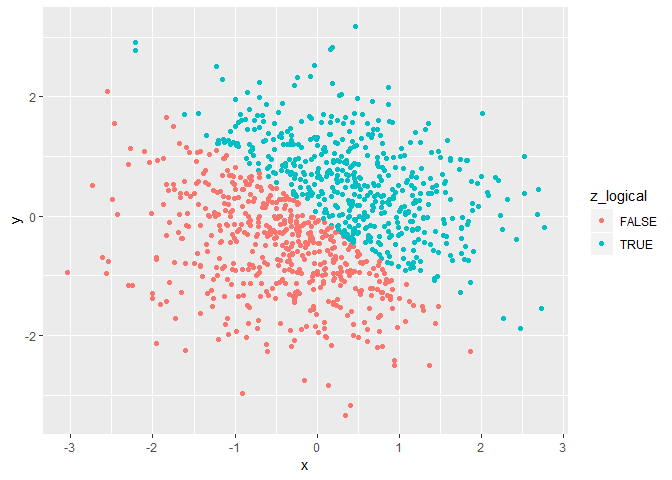
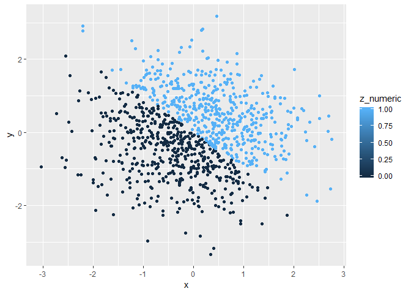
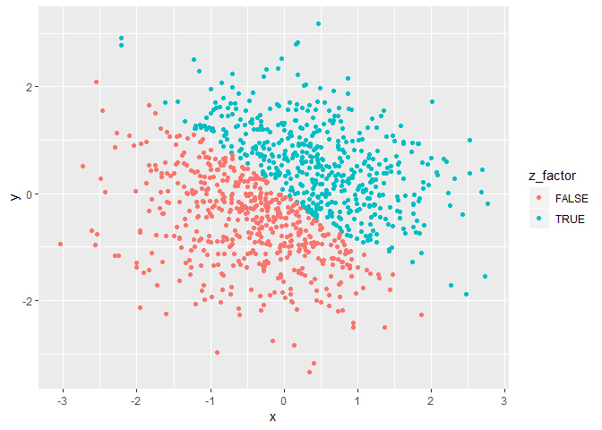

P8105 Data Science: Homework 1
================
Annie Clark (alc2279)
2018-09-21

Problem 0.1 - Workflow
======================

### Prompt:

This "problem" focuses on the use of R Markdown to write reproducible reports, GitHub for version control, and R Projects to organize your work.

To that end:

-   create a public GitHub repo + local R Project; we suggest naming this repo / directory p8105\_hw1\_YOURUNI (e.g. p8105\_hw1\_ajg2202 for Jeff), but that's not required
-   create a single .Rmd file named p8105\_hw1\_YOURUNI.Rmd that renders to github\_document

Your solutions to Problems 1 and 2 should be implemented in your .Rmd file, and your git commit history should reflect the process you used to solve these Problems.

For this Problem, we will assess adherence to the instructions above regarding repo structure, git commit history, and whether we are able to knit your .Rmd to ensure that your work is reproducible.

Problem 0.2 - Styling
=====================

### Prompt:

This "problem" focuses on correct styling for your solutions to Problems 1 and 2. We will look for:

-   meaningful variable / object names
-   readable code (one command per line; adequate whitespace and indentation; etc)
-   clearly-written text to explain code and results
-   a lack of superfluous code (e.g. no unused variables are defined)

Problem 1 - Variable types and coercion
=======================================

Part 1 - Create a data frame
----------------------------

### Prompt:

Create a data frame comprised of:

-   A random sample of size 10 from a uniform \[0, 5\] distribution
-   A logical vector indicating whether elements of the sample are greater than 2
-   A (length-10) character vector
-   A (length-10) factor vector

### Response:

``` r
library(tidyverse)
```

    ## -- Attaching packages --------------------------------------------------- tidyverse 1.2.1 --

    ## v ggplot2 3.0.0     v purrr   0.2.5
    ## v tibble  1.4.2     v dplyr   0.7.6
    ## v tidyr   0.8.1     v stringr 1.3.1
    ## v readr   1.1.1     v forcats 0.3.0

    ## -- Conflicts ------------------------------------------------------ tidyverse_conflicts() --
    ## x dplyr::filter() masks stats::filter()
    ## x dplyr::lag()    masks stats::lag()

``` r
# set seed to ensure reproducibility
set.seed(2)

# create data frame 
prob_1_data_frame = tibble(
  vec_numeric = runif(10, 0, 5),
  vec_logical = vec_numeric > 2,
  vec_char = c("Puppies", "make", "the", "world", "go", "round", "and", "round", 
               "and", "round"),
  vec_factor = factor(c("male", "male", "female", "female", "male", "male", 
                        "female", "female", "male", "female"))
)
```

Part 2 - Mean of variable types
-------------------------------

### Prompt:

Try to take the mean of each variable in your dataframe. What works and what doesn't? Why?

### Response:

``` r
# mean of numeric vector
mean(prob_1_data_frame$vec_numeric)
```

    ## [1] 2.748279

``` r
## mean of logical vector
mean(prob_1_data_frame$vec_logical)
```

    ## [1] 0.7

``` r
# mean of character vector
mean(prob_1_data_frame$vec_char)
```

    ## Warning in mean.default(prob_1_data_frame$vec_char): argument is not
    ## numeric or logical: returning NA

    ## [1] NA

``` r
# mean of factor vector
mean(prob_1_data_frame$vec_factor)
```

    ## Warning in mean.default(prob_1_data_frame$vec_factor): argument is not
    ## numeric or logical: returning NA

    ## [1] NA

The mean of numeric variable works and returns an arithmetic mean of all of the numbers in the random sample. The mean of the logical variable also works and returns a number, which represents the proportion of "TRUE" values in the vector (i.e. TRUE is converted to 1, FALSE is converted to 0 and arithmetic mean is taken). The mean of the character and factor vectors do not work because there is no logical way for R to add up all of the values and take the average. An "NA" is returned for these two variables.

Part 3 - Coercing variables
---------------------------

### Prompt:

In some cases, you can explicitly convert variables from one type to another. Write a code chunk that applies the as.numeric function to the logical, character, and factor variables (please show this chunk but not the output). What happens?

### Response:

``` r
# convert logical to numeric
as.numeric(vec_logical) 

# convert character to numeric
as.numeric(vec_char) 

# convert factor to numeric
as.numeric(vec_factor) 
```

When converting different variable types to numeric, the following occurs:

-   Logical variables: "TRUE" values convert to 1 and "FALSE" values convert to 0.
-   Character variables: unable to convert to a numeric variable and NAs are introduced.
-   Factor variables: unique values are ordered alphabetically and then assigned an ascending number, starting at 1. Each value in the vector is then assigned its appropriate number.

Part 4 - Coercing variables (cont.)
-----------------------------------

### Prompt:

In a second code chunk, convert your character variable from character to factor to numeric; similarly, convert your factor variable from factor to character to numeric. What happens?

### Response:

``` r
# convert character to factor to numeric 
vec_char_to_factor = as.factor(prob_1_data_frame$vec_char)
vec_char_to_factor
```

    ##  [1] Puppies make    the     world   go      round   and     round  
    ##  [9] and     round  
    ## Levels: and go make Puppies round the world

``` r
vec_char_to_factor_to_numeric = as.numeric(vec_char_to_factor)
vec_char_to_factor_to_numeric
```

    ##  [1] 4 3 6 7 2 5 1 5 1 5

``` r
# convert factor to character to numeric
vec_factor_to_char = as.character(prob_1_data_frame$vec_factor)
vec_factor_to_char
```

    ##  [1] "male"   "male"   "female" "female" "male"   "male"   "female"
    ##  [8] "female" "male"   "female"

``` r
vec_factor_to_char_to_num = as.numeric(vec_factor_to_char)
```

    ## Warning: NAs introduced by coercion

``` r
vec_factor_to_char_to_num
```

    ##  [1] NA NA NA NA NA NA NA NA NA NA

When converting from character to factor, the character information is not lost, but each of the unique character sequences are converted into different factor levels. (The characters also lose their quotation marks.) Further, when the character -&gt; factor vector is converted to numeric, the unique values (or the factor levels) are ordered alphabetically and assigned an ascending number, starting at 1. Each value in the vector is then assigned its appropriate number.

When converting from factor to charcter, there is no information lost. The factor values just become characters (as seen with the introduction of quotation marks). When the factor -&gt; character vector is converted to a number, information IS lost. Since there is no logical way for R to convert characters to numbers, NAs for each value is introduced.

Problem 2 - Plotting and inline R code
======================================

Part 1 - Create a data frame
----------------------------

### Prompt:

Create a data frame comprised of:

-   x: a random sample of size 1000 from a standard Normal distribution
-   y: a random sample of size 1000 from a standard Normal distribution
-   A logical vector indicating whether the x + y &gt; 0
-   A numeric vector created by coercing the above logical vector
-   A factor vector created by coercing the above logical vector

### Response:

``` r
# set seed to ensure reproducibility
set.seed(9) 

# define datframe
prob_2_data_frame = tibble(
  x = rnorm(1000),
  y = rnorm(1000),
  z_logical = (x + y) > 0,
  z_numeric = as.numeric(z_logical),
  z_factor = as.factor(z_logical)
)
```

Part 2 - Inline description of data frame variables
---------------------------------------------------

### Prompt:

-   Write a short description of your vector using inline R code, including: the size of the dataset, the mean and median of x, the proportion of cases for which the logical vector is TRUE.

### Response:

There are 5 columns and 1000 rows in the data set created for problem 2. The mean of variable x is, 0.0058848 and the median is, 0.0310737. The proportion of cases for which the logical vector, z\_logical, is TRUE is 0.499.

Part 3 - Scatterplots
---------------------

### Prompt:

Make a scatterplot of y vs x; color points using the logical variable (adding color = ... inside of aes in your ggplot code should help). Make a second and third scatterplot that color points using the numeric and factor variables, respectively, and comment on the color scales.

### Response:

``` r
# scatterplot of y vs x using z_logical to color points
plot_y_x_color_logical = ggplot(prob_2_data_frame, aes(x = x, y = y, color = z_logical)) + geom_point()
plot_y_x_color_logical
```



``` r
# scatterplot of y vs x using z_num to color points
ggplot(prob_2_data_frame, aes(x = x, y = y, color = z_numeric)) + geom_point()
```



``` r
# scatterplot of y vs x using z_factor to color points
ggplot(prob_2_data_frame, aes(x = x, y = y, color = z_factor)) + geom_point()
```



The logical, numeric and factor "z" variables all contain the same information, so it's not surprising to see a common trend in all three scatterplots. Each plot displays a pretty distinct line separtaing colors along y = -x. This is because when x + y &gt; 0, z\_logical = "TRUE", z\_numeric = 1 and z\_factor are TRUE; in all three scatterplots, these groupings appear as one color. When x + y =&lt; 0, z\_logical = "FALSE", z\_numeric = 0 and z\_factor = FALSE and the coloring of these points appear in a different color.

The biggest difference in these three plots is found in the scatterplot grouped by the numeric variable. Because this variable can take on any value between 0 and 1, a color gradient is possible; in this case, because only 0s and 1s are present, only the lightest and darkest colors are used.

Part 4 - Exporting scatterplot
------------------------------

### Prompt:

Export your first scatterplot to your project directory using ggsave.

### Response:

``` r
##export scatterplot of y vs x using z_logical to color points
ggsave("prob_2_random_sample_scatter_plot.pdf", plot = plot_y_x_color_logical, height = 4, width = 6)
```
